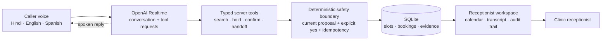

# Turno

**A multilingual voice receptionist that makes clinic scheduling transactions dependable.**

Turno is a multilingual voice receptionist for a fictional clinic. A caller can speak in Hindi, English, Spanish, or a mix; interrupt the assistant; correct appointment details; hear available times; and confirm a booking.

## Who it is for

Turno is built for a small outpatient clinic that receives appointment-booking calls.

- **Paying customer:** The clinic or medical practice.
- **End user:** A patient calling to schedule an annual checkup or follow-up visit.
- **Staff user:** A receptionist who monitors calls, confirmed appointments, and requests that need human help.

Patients get a simple voice experience in their preferred language. The clinic gets fewer unanswered calls, less repetitive scheduling work, reliable bookings, and clear human handoffs.

Turno is a scheduling receptionist, not a medical assistant. It does not diagnose symptoms, recommend treatment, perform triage, or make medical decisions.

The central engineering idea is simple:

> The AI handles the conversation. Normal, testable software controls the booking.

## What makes Turno different

A general-purpose voice agent can talk and call a calendar tool. Turno focuses on the harder problem: completing a consequential transaction safely when the caller interrupts, changes their mind, responds ambiguously, or causes the same action to be retried.

> Turno is a reliability layer for real-world voice transactions, demonstrated through appointment scheduling.

## What the demo should prove

- A caller has a natural voice conversation in the browser.
- Turno understands a correction made during the conversation.
- Availability comes from the scheduling service, not from the model.
- Turno reads back the full appointment and waits for a clear confirmation.
- An ambiguous response asks for clarification and cannot create a booking.
- The booking is stored exactly once, even if confirmation is repeated.
- If a held slot is lost, Turno explains the conflict and offers a new real slot.
- A receptionist dashboard shows the transcript, tool activity, calendar, booking, and audit trail.
- Unsupported or uncertain requests become a human handoff instead of a fabricated answer.

The browser voice experience is the main path. A real inbound phone number, cited clinic-information search, and public deployment are optional additions.

## Try the proof without an API key

The app includes deterministic buttons for the risky paths, so the reliability work is still demonstrable if venue audio, Wi-Fi, or model access fails:

1. Run **Guided reliability demo** to see a Hindi-English request, a corrected time constraint, an ambiguous confirmation blocked, a clear confirmation committed, and a repeated commit deduplicated.
2. Run **Prove conflict recovery** to take a held slot immediately before commit. Turno reports no false success and searches the current schedule again.
3. Run **Create safe handoff** to turn a medical question into a visible receptionist handoff without answering it.

All names, appointments, and clinic details are synthetic.

## Architecture



The Realtime model never writes a booking directly. It requests a typed tool; server code verifies current state and authoritative transcript evidence; only a successful database transaction publishes a booking event.

## Run locally

Requirements: Node.js 22 or newer and pnpm.

```bash
pnpm install
cp .env.example .env.local
pnpm dev
```

Open [http://127.0.0.1:3100](http://127.0.0.1:3100). The guided proof paths work with the empty example environment.

To enable live browser voice, put your own OpenAI API key in `.env.local`:

```dotenv
OPENAI_API_KEY=your_key_here
```

The key remains on the server. The browser receives only a short-lived Realtime client secret. Do not commit `.env.local`.

## Verify the reliability layer

```bash
pnpm typecheck
pnpm test
pnpm build
```

The deterministic suite covers multilingual confirmation, ambiguous replies, corrected search constraints, appointment-type filtering, stale or lost slots, one-time recovery, safe handoff, and exactly-once booking retries.

## Start here

- Coding agents: read [AGENTS.md](AGENTS.md).
- Builders: read [docs/BUILD_SPEC.md](docs/BUILD_SPEC.md).
- New teammates: read [docs/TEAM_GUIDE.md](docs/TEAM_GUIDE.md).

## Stack and sponsor use

- **OpenAI:** `gpt-realtime-2`, Realtime Agents SDK, WebRTC audio, and function tools.
- **CopilotKit:** exposes the trusted application snapshot and safe frontend demo actions to an embedded agent runtime.
- **Product code:** TypeScript, Next.js, React, Zod, SQLite with `better-sqlite3`, and Vitest.
- **Browser agents:** progressive WebMCP tools expose read/reset/conflict actions when the browser supports the proposed API.
- **Optional after the core demo:** Exa for cited public clinic logistics, Google Cloud Run for deployment, and a SIP provider for a real inbound number.

OpenRouter, Auth0, Trigger.dev, and Mozilla are hackathon sponsors but are not forced into the current build. Turno uses integrations only when they improve the product or its evidence.

## API boundaries

| Component | Input | Output | Talks to |
| --- | --- | --- | --- |
| Browser voice | Microphone audio | Spoken replies and transcript | Realtime session |
| Realtime assistant | Audio, instructions, typed tool results | Audio and typed tool calls | Browser and server tools |
| Search | Date, time window, appointment type | Currently available seeded slots | SQLite schedule |
| Hold | Selected slot ID | Proposal ID, expiry, canonical readback | Conversation + slots |
| Confirm | Current proposal ID and stored final caller turn | One booking or a typed recoverable error | Confirmation gate + SQLite |
| Handoff | Reason and concise summary | Open handoff record | Receptionist workspace |
| Dashboard | Trusted snapshot and event sequence | Calendar, booking, evidence, activity | Clinic staff |

The complete contracts and independent component guidance live in [docs/BUILD_SPEC.md](docs/BUILD_SPEC.md).

## Build status

Built during the September 12, 2026 Agents Everywhere hackathon. The browser workspace, synthetic schedule, Realtime voice connection, server-side transaction boundary, guided reliability scenarios, CopilotKit context, WebMCP tools, and deterministic tests are implemented.

## Reuse disclosure

The Realtime WebRTC and CopilotKit wiring follows the public CopilotKit Agents Everywhere starter patterns. Turno's product design, visual interface, scheduling domain, SQLite state model, confirmation boundary, conflict recovery, handoff behavior, guided demonstrations, and tests were built in this repository during the event.

## Safety and privacy

Turno is a fictional-clinic prototype. Use synthetic names and appointments only. Do not use real patient information, provide medical advice, record raw audio, or commit API keys.
